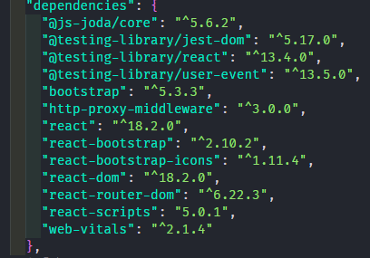
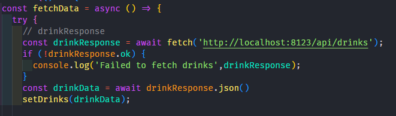
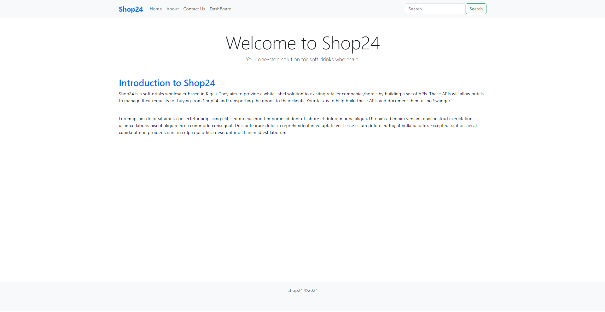
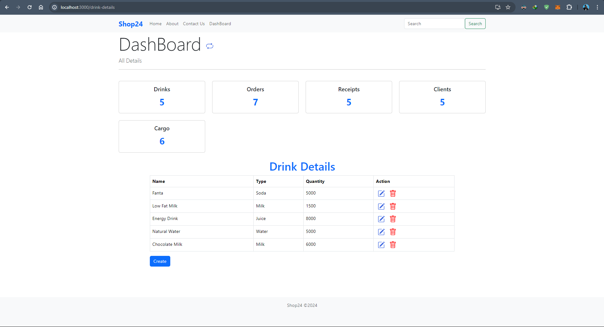
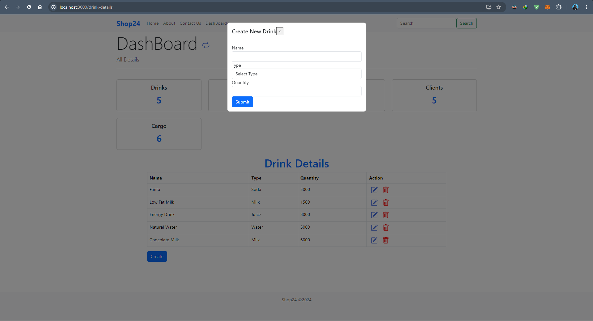
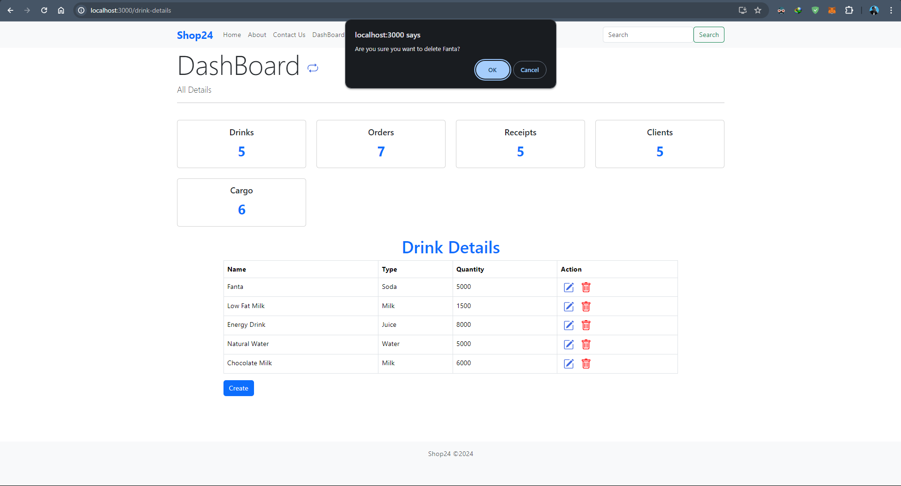

# Getting Started with Shop24 React App

This project was bootstrapped with [Create React App](https://github.com/facebook/create-react-app).

## Available Scripts

In the project directory, you can run:

### `npm start`

Runs the app in the development mode.\
Open [http://localhost:3000](http://localhost:3000) to view it in your browser.

The page will reload when you make changes.\
You may also see any lint errors in the console.

## Shop24

- BPR Internship Shop24 Challenge

## Introduction to Shop24

### Who is Shop24?

Shop24 is a soft drinks wholesaler based in Kigali. They would like to avail their services to the public by providing a white-label solution to the
existing retailer companies/hotels. Practically, they will build a set of APIs that hotels will use to manage their requests of buying from
Shop24 and transport to their clients. They would like your help building these APIs and document them using swagger

### Technology constraints

• At the BPR PLC Bank, we currently have a microservices architecture with services mostly written in Spring Boot (Java or Kotlin).

• We would like you to develop a single service in either Spring Boot that exposes several REST endpoints (see next page)

• You can use whatever database you want (we recommend using SQLite, MySQL or Postgres)

• You should include a README file that has instructions for us to get the solution running on our machines

# Technologies Used

- React v18

# Dependencies Used

# How it Works!

This Shop24 react app needs to fetch data(JSON) from our server `http://localhost:8123/` and React will handle the Data

- ## For example

# The View

- ## but we focused on the Project Dashboard

- ## Dashboard and CRUD Function

- ## click on blue numbers to bring the table and this Dashboard is very responsive even if in Create and Delete automatic refresh no need to reload

- ## ShowForm and Model Show

- ## Window prompt

